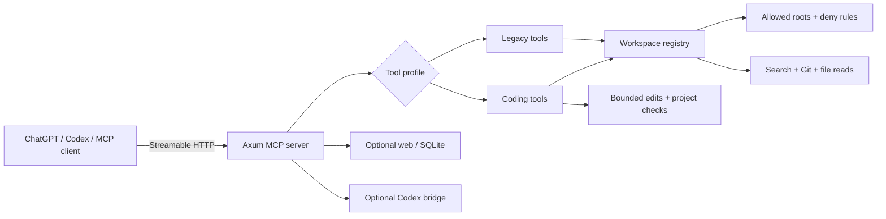

<div align="center">

# ChatGPT Codex Desktop MCP — Rust

### A tiny, thoughtful bridge between coding agents and local projects.

<p>
  <a href="https://www.rust-lang.org/"></a>
  <a href="https://docs.rs/axum"></a>
  <a href="https://modelcontextprotocol.io/"></a>
  
</p>

<p><code>open → inspect → search → edit carefully → verify</code></p>

<p>Give an agent just enough access to be useful — and enough guardrails to stay predictable.</p>

</div>

Built with Rust, Axum, and the Model Context Protocol, this server turns a
local workspace into a disciplined tool surface for AI coding workflows:
project discovery, code search, file reads, Git inspection, safe edits,
controlled processes, optional web/SQLite access, and delegated Codex sessions.

The original TypeScript server remains a separate reference implementation.
This repository is the independent Rust port: lower overhead, clearer
boundaries, and small modules that are easy to review and fix.

> [!TIP]
> Start with `review` mode. Move to `coding` only when the agent needs to
> apply bounded edits. Keep the server on loopback and use a private tunnel
> for remote MCP clients.

<details>
<summary>Jump to a section</summary>

- [Why this exists](#-why-this-exists)
- [At a glance](#-at-a-glance)
- [Architecture](#-architecture)
- [Choose your vibe](#-choose-your-vibe)
- [Security model](#-security-model)
- [Quick start](#-quick-start)
- [Connecting an MCP client](#-connecting-an-mcp-client)
- [Configuration](#-configuration)
- [Search engine](#-search-engine)
- [Repository layout](#-repository-layout)
- [Compatibility and status](#-compatibility-and-status)
- [Development checks](#-development-checks)

</details>

## Why this exists

Coding agents are most useful when they can inspect and change a real project,
but raw filesystem and shell access is a poor contract. This server puts an MCP
interface in front of the local machine and makes the important boundaries
explicit:

- Which roots the agent may open.
- Which files and patterns are denied by default.
- Which access mode is active.
- Which commands are allowed.
- Which edits require preview and confirmation.
- How much data and time each operation may consume.

The result is a tool surface that is useful to an agent and still reviewable by
the person running it.

## At a glance

| Capability | What it provides |
| --- | --- |
| Workspace isolation | Allowlisted roots, canonical path checks, symlink escape protection, and deny globs for sensitive files. |
| Agent-friendly tools | Composite project tools reduce multi-call workflows to `open_project`, `search_code`, `read_files`, `apply_patch`, and native checks. |
| Fast local search | In-process Git-aware walking, regex/line matching, output caps, context lines, and a watcher-backed trigram candidate index for repeated literal searches. |
| Reviewable edits | Preview/confirm edit flow in the legacy profile and bounded patch variants in coding mode. |
| Controlled execution | Structured argv only, no shell interpolation, access-mode allowlists, timeouts, output caps, and managed process lifecycle. |
| Safe optional integrations | Public-only HTTP fetch, SearXNG search, and allowlisted SQLite with read-only queries plus preview/confirm mutations. |
| Codex bridge | Optional local delegated Codex app-server sessions scoped to an opened workspace. |
| MCP-native transport | Streamable HTTP at `/mcp`, health checks at `/healthz`, session TTL cleanup, and optional stateless fallback. |
| Structured contracts | Human-readable text is paired with structured JSON output so both people and clients can consume results. |

## Architecture



## Choose your profile

The server exposes one primary profile at a time. Optional integrations remain
disabled by default and are guarded by configuration.

| Mood | Profile | Best for |
| --- | --- | --- |
| **Curious** | `legacy` + `review` | Read-only exploration, search, Git inspection, and previews. |
| **Builder** | `coding` + `coding` | Desktop coding workflows with bounded edits and safe project checks. |
| **Power user** | `legacy` + `full` | Broader structured process access while shells and dangerous patterns remain blocked. |

### `legacy` — the granular toolbox

The granular workspace-oriented surface:

- `local_status`, `open_workspace`
- `list_dir`, `read_file`, `search_files`, `find_files`, `project_tree`
- `git_status`, `git_diff`
- `preview_edit`, `confirm_edit`
- `exec_process`, `process_start`, `process_read`, `process_stop`
- Optional: `web_status`, `web_search`, `web_fetch`
- Optional: `sqlite_status`, `sqlite_schema`, `sqlite_select`,
  `sqlite_preview_change`, `sqlite_confirm_change`

### `coding` — the compact agent surface

The compact surface intended for coding agents and desktop project workflows:

- `open_project` — project type, Git status, and a small tree
- `project_state` — status plus staged/unstaged diff summaries
- `search_code` — bounded code search with include/exclude and context
- `read_files` — batch reads for known files
- `apply_patch` — bounded create/edit operations
- `run_project_check` — safe native test, check, lint, build, or format check
- `run_project_command` — one explicit allowlisted command with structured argv
- `manage_process` — start, read, and stop allowed development processes

The Codex bridge is enabled by default in this profile. Disable it explicitly
with `CTM_CODEX_BRIDGE=false` when the host does not provide a local Codex
app-server executable.

## 🛡️ Security model

The secure default is intentionally boring: bind locally, allow only declared
roots, and make every higher-risk capability explicit.

- **Loopback by default:** the server binds to `127.0.0.1:3333`.
- **Root allowlist:** a workspace must resolve inside `CTM_ALLOWED_ROOTS`.
- **Path hardening:** parent traversal, symlink escapes, and denied paths are
  rejected before filesystem access.
- **Sensitive-file defaults:** `.env`, private keys, tokens, secrets, and
  certificate/key material are covered by default deny globs.
- **Three access modes:** `review` is read-only; `coding` enables bounded edits
  and safe project checks; `full` permits the broader structured process policy
  while still rejecting shells and dangerous patterns.
- **No shell execution:** process tools receive an executable and an argv list;
  shell interpolation is not used.
- **Resource caps:** reads, output, request bodies, process lifetimes, search
  matches, and SQLite rows are bounded.
- **Two-phase writes:** legacy edits and SQLite mutations use preview/confirm;
  coding edits accept only the supported bounded patch variants.
- **Public web fetch only:** web fetch sends no cookies or authorization
  headers, rejects credentials in URLs, blocks localhost/private targets, and
  checks redirects.

Keep the server on loopback. If a remote MCP client is required, expose it only
through a private, authenticated tunnel.

## Quick start

### 1. Clone and verify

```bash
git clone https://github.com/WIKKIwk/chatgpt-codex-desktop-mcp.git
cd chatgpt-codex-desktop-mcp

cargo fmt --all -- --check
cargo test --locked
cargo clippy --all-targets --locked -- -D warnings
```

### 2. Start a review-only server

```bash
CTM_ALLOWED_ROOTS="$PWD" \
CTM_TOOL_PROFILE=legacy \
CTM_ACCESS_MODE=review \
cargo run --release --locked
```

The endpoints are:

```text
MCP:    http://127.0.0.1:3333/mcp
Health: http://127.0.0.1:3333/healthz
```

Check health from another terminal:

```bash
curl -fsS http://127.0.0.1:3333/healthz
```

### 3. Start the coding-agent profile

Point the allowlist at the project the agent should work on:

```bash
CTM_ALLOWED_ROOTS="/absolute/path/to/project" \
CTM_TOOL_PROFILE=coding \
CTM_ACCESS_MODE=coding \
cargo run --release --locked
```

For a reproducible local configuration, copy
[`config.example.json`](config.example.json) to `config.json`. Environment
variables take precedence over file values, and `config.json` is intentionally
ignored by Git.

## Connecting an MCP client

Use a Streamable HTTP MCP connector pointed at:

```text
http://127.0.0.1:3333/mcp
```

The transport is session-aware and keeps sessions alive for 30 minutes of
inactivity. Set `CTM_STATELESS_MCP_FALLBACK=true` only when the client cannot
maintain an MCP session; stateful routing remains the default.

## Configuration

Configuration can be supplied through `config.json` or environment variables.
The precedence order is:

```text
environment variable > config.json > built-in default
```

### Core server

| Variable | Purpose | Default |
| --- | --- | --- |
| `HOST` | Bind address | `127.0.0.1` |
| `PORT` | HTTP port | `3333` |
| `CTM_ALLOWED_ROOTS` | Comma-separated allowed workspace roots | Current directory |
| `CTM_DENY_GLOBS` | Comma-separated additional/replacement deny globs | Sensitive-file defaults |
| `CTM_TOOL_PROFILE` | `legacy` or `coding` | `legacy` |
| `CTM_ACCESS_MODE` | `review`, `coding`, or `full` | `review` |
| `CTM_STATELESS_MCP_FALLBACK` | Accept stateless POST fallback | `false` |
| `CTM_MAX_READ_BYTES` | Per-read byte cap | `200000` |
| `CTM_MAX_OUTPUT_BYTES` | Tool/process output cap | `200000` |
| `CTM_CONFIG_PATH` | Alternate JSON config path | `./config.json` |

### Codex bridge

| Variable | Purpose | Default |
| --- | --- | --- |
| `CTM_CODEX_BRIDGE` | Enable delegated Codex sessions | Profile-dependent |
| `CTM_CODEX_COMMAND` | Codex executable or bundled macOS path | `codex` |
| `CTM_CODEX_MAX_SESSIONS` | Concurrent delegated sessions | `4` |
| `CTM_CODEX_REQUEST_TIMEOUT_MS` | Bridge request timeout | `120000` |

### Web and SQLite

| Variable | Purpose | Default |
| --- | --- | --- |
| `CTM_WEB_TOOLS` | Enable web tools | `false` |
| `CTM_SEARCH_PROVIDER` | `none` or `searxng` | `none` |
| `CTM_SEARXNG_URL` | SearXNG base URL | Empty |
| `CTM_WEB_MAX_BYTES` | Web response cap | `200000` |
| `CTM_WEB_TIMEOUT_MS` | Web request timeout | `15000` |
| `CTM_SQLITE_TOOLS` | Enable SQLite tools | `false` |
| `CTM_SQLITE_ALLOWED_DBS` | Comma-separated database paths | Empty |
| `CTM_SQLITE_MAX_ROWS` | Maximum returned rows | `100` |

## 🔎 Search engine

`search_code` is implemented in Rust instead of spawning a shell search
command:

1. A Git-aware walker filters ignored, denied, and unsafe paths.
2. The line searcher performs exact or regex matching with case control,
   context lines, include/exclude globs, and output limits.
3. Repeated ASCII literal searches can use a generation-aware trigram index to
   narrow candidate files.
4. A filesystem watcher marks the index dirty after changes; exact matching
   still runs on the selected files, so the index is an accelerator rather than
   a correctness shortcut.

This keeps search local, bounded, and predictable while making repeated agent
queries cheaper.

## Repository layout

The code is deliberately split into focused modules. Production Rust source
files are kept below 500 lines so reviews and fixes stay local to one concern.

| Path | Responsibility |
| --- | --- |
| `src/server/` | Axum routes, MCP transport, sessions, profiles, tool metadata, and response contracts |
| `src/workspace/` | Allowed roots, deny rules, path safety, workspace registry, search, and Git helpers |
| `src/edit/` | Preview/confirm edit storage and bounded change application |
| `src/process/` | Structured process execution, policy checks, output caps, and managed processes |
| `src/web/` | SearXNG search and public HTTP fetch security policy |
| `src/sqlite/` | Database allowlisting, read-only queries, and guarded changes |
| `src/codex/` | Delegated local Codex session bridge |
| `src/config.rs` | JSON/env configuration parsing and defaults |

## Compatibility and status

This is an independent Rust implementation of the local workspace MCP server.
The TypeScript repository remains the reference while behavior and response
contracts are validated incrementally. The Rust server already includes
focused coverage for workspace safety, MCP sessions, structured tool results,
search behavior, edit confirmation, process policy, web restrictions, SQLite
guards, and coding-profile workflows.

Before switching a production or tunnel deployment, validate the exact client
contract you depend on against the configured profile and run the local checks
below.

## Development checks

```bash
cargo fmt --all -- --check
cargo test --locked
cargo clippy --all-targets --locked -- -D warnings
cargo build --release --locked
```

When adding a tool or changing a safety boundary:

1. Add or update a focused test for the behavior and error path.
2. Keep the human-readable response and structured output aligned.
3. Preserve the access-mode, path, output, and timeout limits.
4. Keep the reference TypeScript checkout separate from this repository.

## License

No license has been declared yet. Until one is added to the repository, treat
the code as source-available rather than implicitly open source.

<div align="center">

<sub>Made for calm, capable coding agents. Built with Rust and a little care.</sub>

</div>
